# SwiftUI List

After having struggled for a few days with various issues of SwiftUIs `List` on macOS, I decided to write down my personal journey as a "GitHub article".

The `List` view in SwiftUI is very powerful and can be easily applied. But as soon as you start to use them you will encounter some quirks.

---

## Basics

In it's most simple form, a `List` view can be created in 3 lines:

```swift
List(data) { element in
    Text(element.text)
}
```

There are also many other `List` initializers available, some based on integer ranges, others based on data with associated identifier. In general it is good practice to have the element conform to `Identifiable`, i.e. it has an `id` property which is unique within the collection as our `DataWrapper` example below.

```swift
struct DataWrapper: Identifiable {
    let id = UUID()
    var text: String
}
```

Looking at the images below, we confirm that on iPhone this really os the most basic form we see in many apps. On macOS the list looks even bolder: there are even no visible dividers!

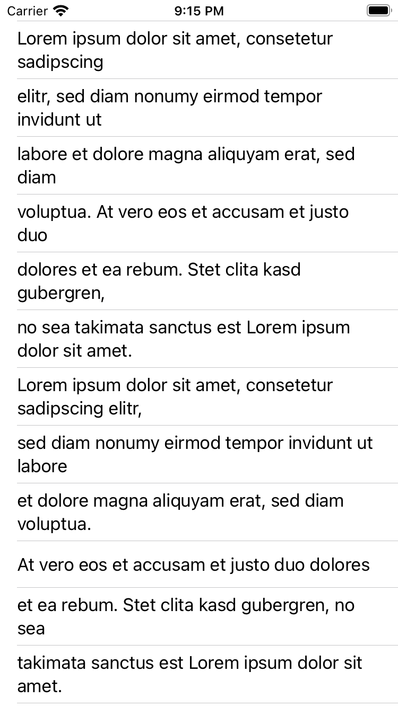  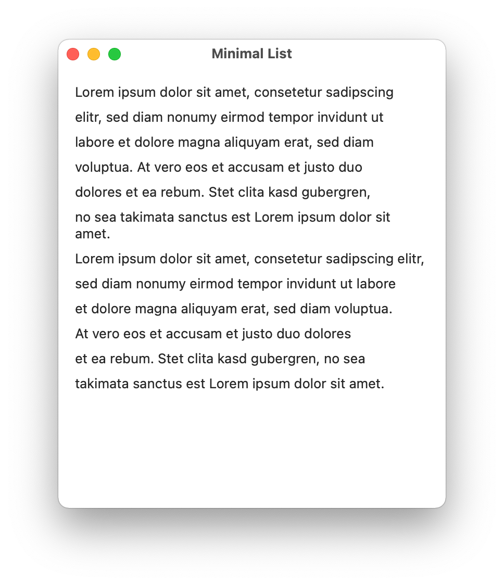

The full source-code of those views can be found in [Shared/MinimalList.swift](Shared/MinimalList.swift).

---

## Adding Selection

If we want now to have the possibility to select a row, we have to define a state variable to store the selected row (ID) and add the `selection:` parameter to the `List` initializer:

```swift
@State private var selection: UUID?
```

```swift
List(data, selection: $selection) { element in
    Text(element.text)
}
```

On macOS this simple addition already enables the selection handling. It allows us to select a row by clicking it and move the selection with the arrow keys.

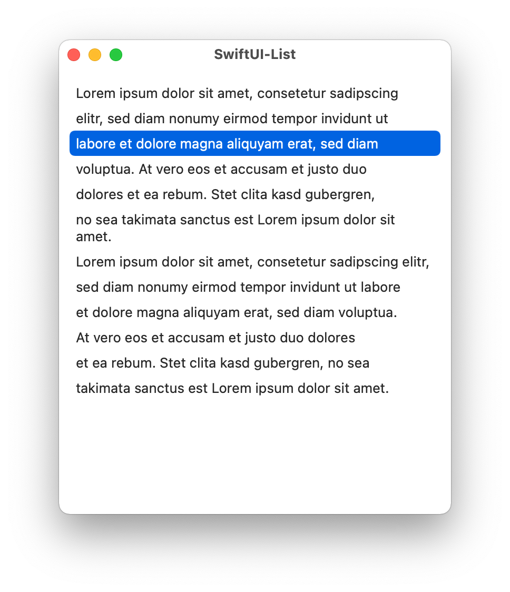

On iPhone we won't see any difference yet. This is due to the fact, that the row selection elements are only visible if the list is shown in *edit mode*. Normally a user
enters into *edit mode* explicitly by tapping an "Edit" button (which would be found in a toolbar). But for our purpose it is sufficient to simulate the fact that the edit mode is activated by adding the following line at the end of our `List` content (or any parent view):

```swift
.environment(\.editMode, .constant(.active))
```

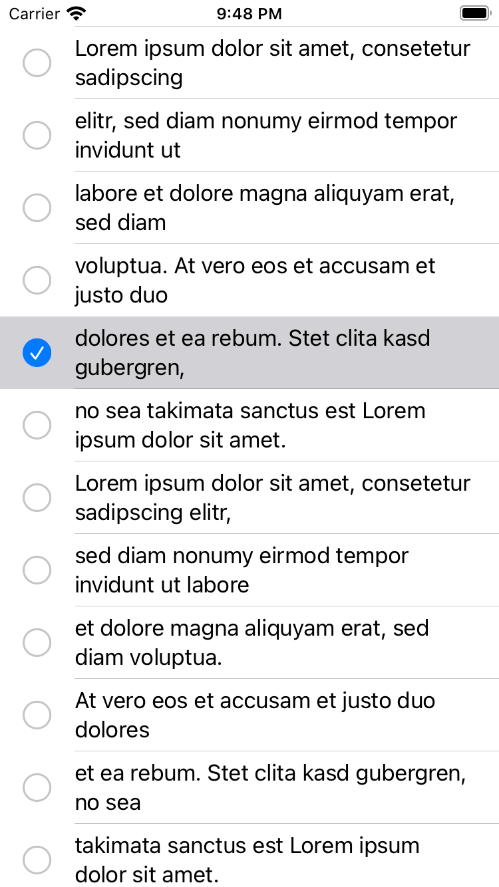

### Enable Multi-Selection

To enable **Multi-Selection** we simply have to adjust our state variable: Instead of defining space for a single selection (Optional<DataWrapper.ID>) we define it as a `Set` of our elements IDs.

```swift
@State private var selection = Set<UUID>()
```

What I really like about the macOS implementation: Out-of-the-box it supports all the possible selection modes using the keyboard modifiers to ease the selection of multiple rows (using Shift+click) and add/remove single rows to the existing selection (using CMD+click). Selection with the arrow keys is also possible!

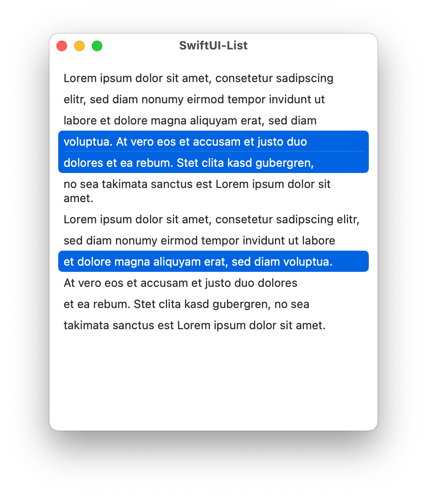  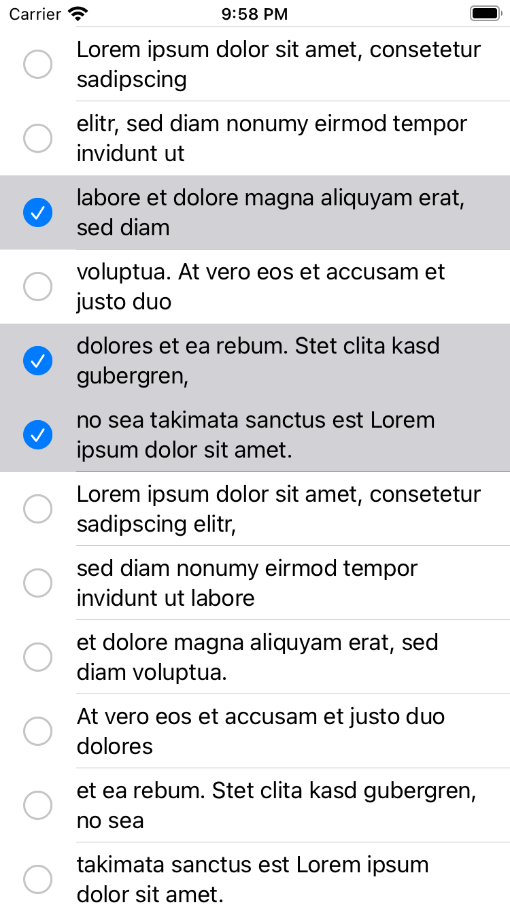

---

## Adding Move

Another nice feature is the built-in support for moving rows within the list by simply adding the `.onMove(perform:)` modifier. But this modifier is not applicable to the `List` view but to the `ForEach` struct, so we have to rewrite our basic list to use `ForEach` to iterate over our elements:

```swift
List(selection: $selection) {
    ForEach(data) { element in
        Text(element.text)
    }
    .onMove(perform: { indices, offset in
        withAnimation {
            data.move(fromOffsets: indices, toOffset: offset)
        }
    })
}
```

As you can see, we use the `Array`s `move` method which takes in parameter `fromOffset` an `IndexSet` with the indices of the selected rows and a `toOffset` with the target row where those have to be inserted. Just by adding this action, we enhanced our list with reordering functionality.

On macOS the availability of the reordering functionality is not immediately visible to the user, but it is commonly known that one can select multiple lines and then drag & drop them to the desired destination. Exactly how it works here.  
On the iPhone reordering handles are showing up on the right side of each line. They are independent of the selection. As a consequence, it is only possible to move one line at the a time.  

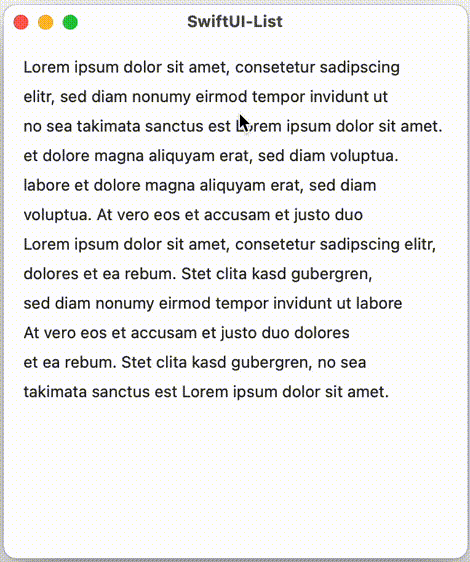  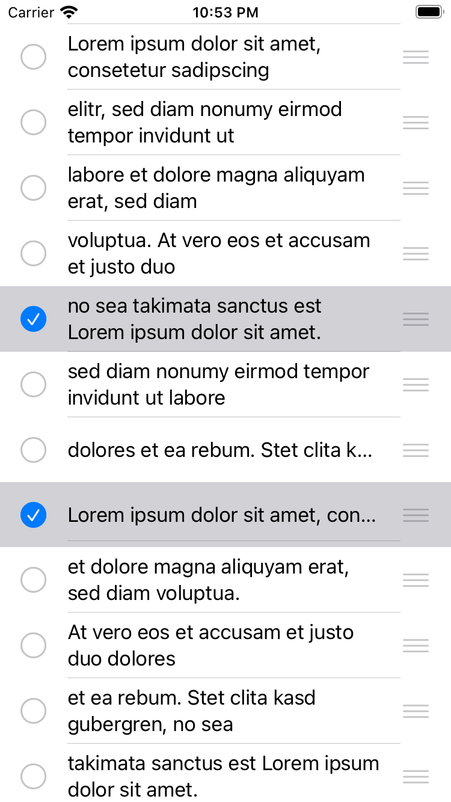

---

## Adding Swipe to Delete

After having split the basic `List` into a `List` container and a `ForEach` iterator, it is an easy exercise to add **swipe to delete** as we have to add only another modifier to the `ForEach` struct: `.onDelete(perform:)`

```swift
List(selection: $selection) {
    ForEach(data) { element in
        Text(element.text)
    }
    .onDelete(perform: { indices in
        withAnimation {
            data.remove(atOffsets: indices)
        }
    })
}
```

When testing this, it becomes immediately visible that swipe to delete is really intended to be applied to a single row: it ignores any selection. Even more: on **iPhone it basically does not work as long as the list is in edit mode**. This means selection & reordering are mutually exclusive to "swipe to delete". If you want to provide a deletion functionality based on the current selection, you will have to add a custom delete button to the toolbar.

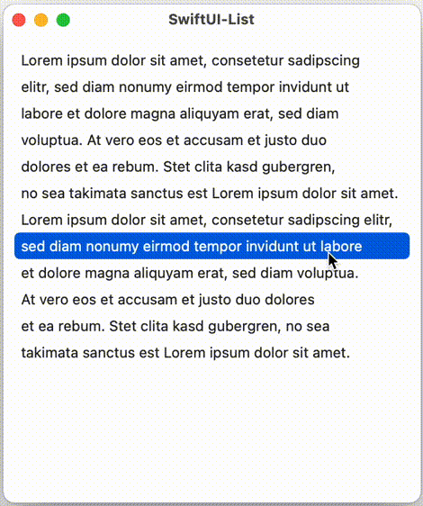  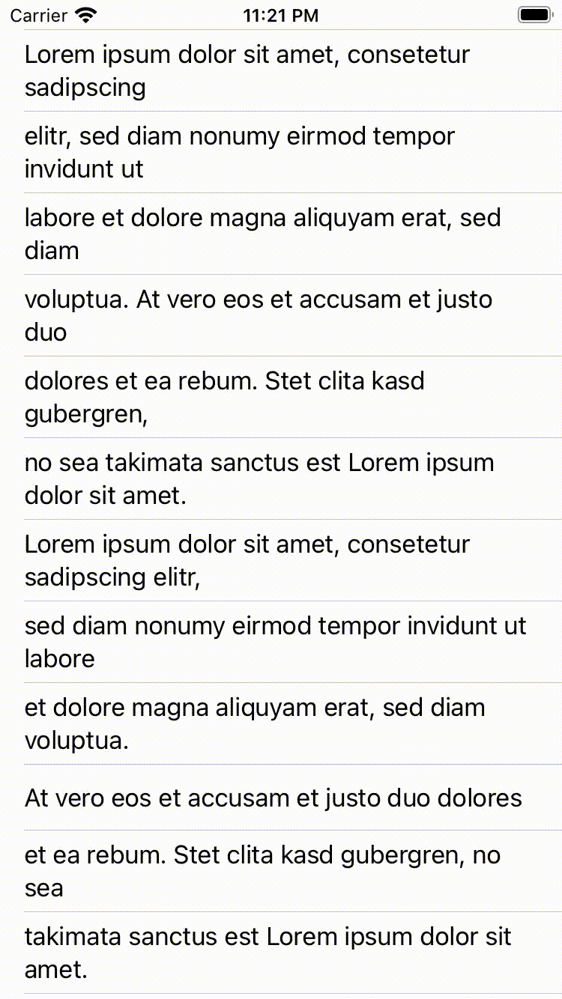

---

## Adding groups/sections

To group similar data visually within a list, it is possible to create sections with headers and footers. While scrolling through a bigger list, the current section header will always stay visible.

```swift
List(selection: $selection) {
    Section(header: Text("Top 3"),
            footer: Text("All this gibberish can be ignored, even though it seems to be some latin dialect it is absolute nonsense.")
                .font(.caption)
    ) {
        ForEach(data.prefix(3)) { element in
            Text(element.text)
        }
    }
    Section(header: Text("Rest")) {
        ForEach(data.dropFirst(3)) { element in
            Text(element.text)
        }
    }
}
```

Be aware: **you cannot move elements between different sections!**

As you can see on the screenshot below, the section header and footers on macOS Big Sur are easily overlooked in the default styling. For the iPhone we see again a known default style for headers.

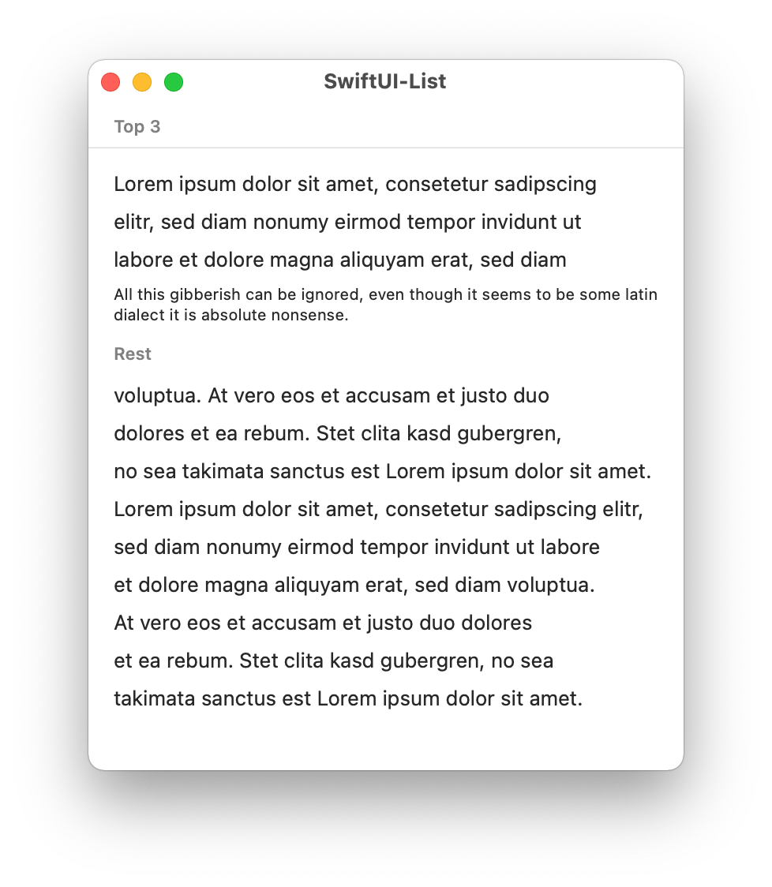  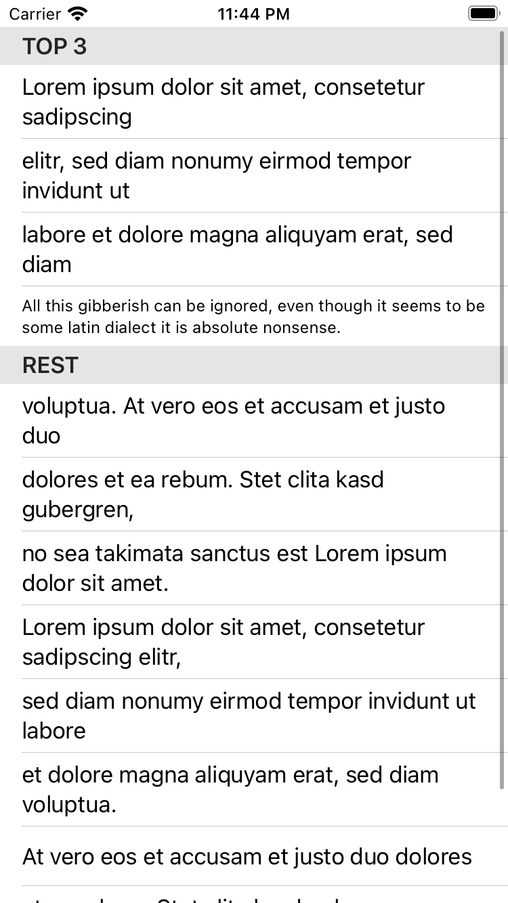

The full source-code for this view can be found in [Shared/BasicList.swift](Shared/BasicList.swift).

---

## Applying list styles

The lists can be styled using one of the following `ListStyle`s

- `PlainListStyle` / `.plain`
- `InsetListStyle` / `.inset`
- `GroupedListStyle` / `.grouped` : iOS only
- `InsetGroupedListStyle` / `.insetGrouped` : iOS only
- `SidebarListStyle` / `.sidebar`
- `BorderedListStyle` / `.bordered` : macOS 12 only

List styles have to be applied onto the `List` by adding for the modifier `.listStyle()` with the appropriate style. Before Swift 5.5 you had to instantiate the list style using for example `InsetGroupedListStyle()`. But with Swift 5.5 better inference for type erased generics has been added and we can now write `.insetGrouped`.

Below are a few screenshots for different list styles on iPhone.

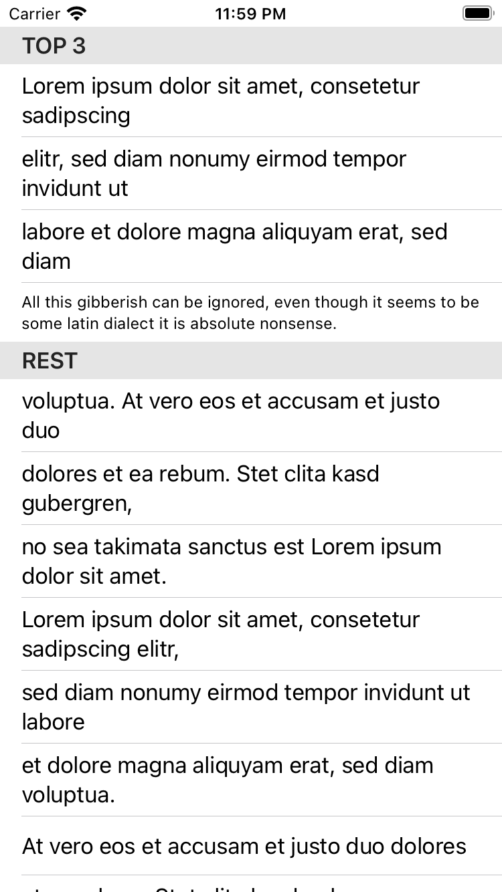  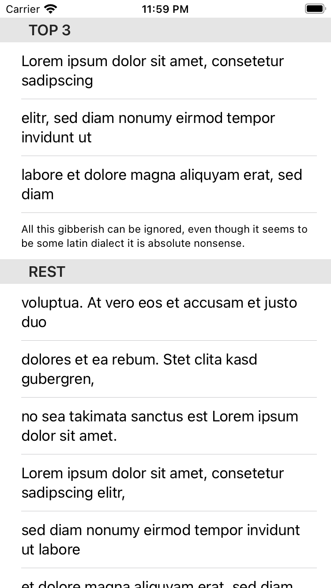  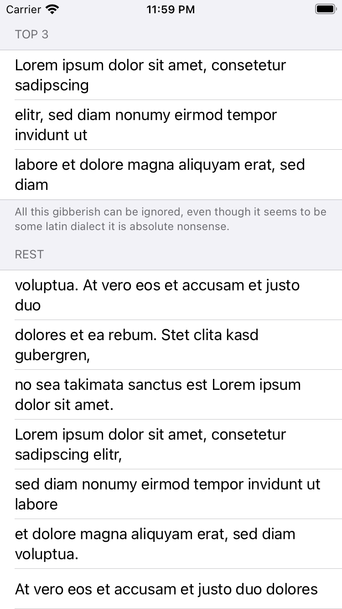

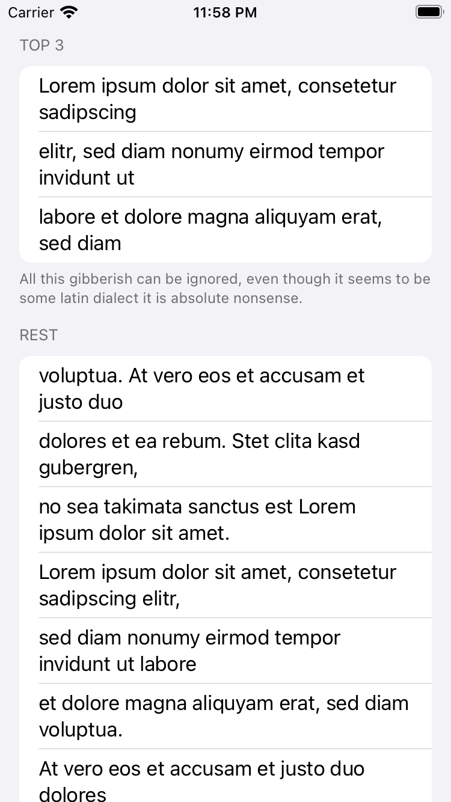  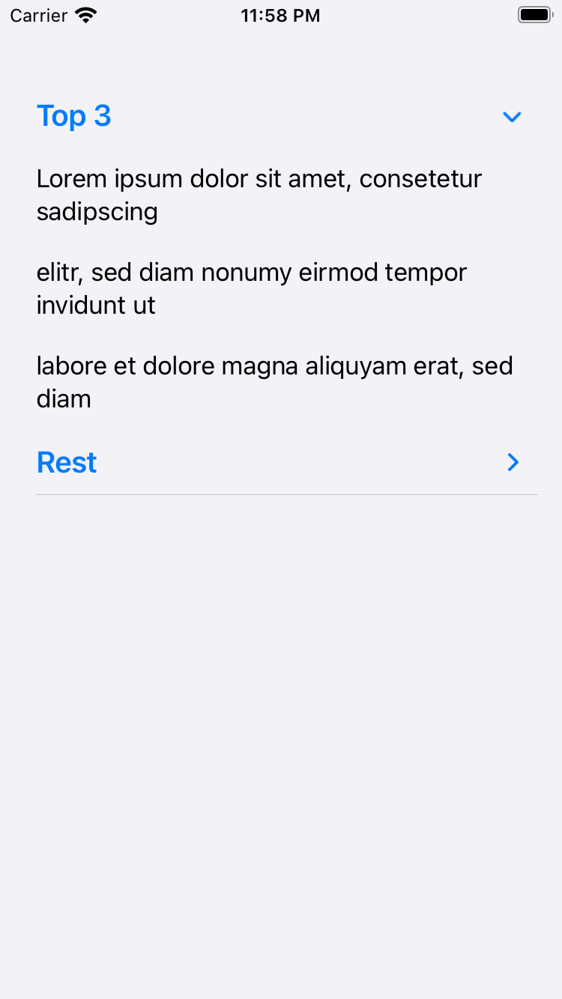

---

## List Row Background

### The nightmare begins

When you start to use `List` in more and more sophisticated ways, you will sooner or later feel the desire to change the background color of a row. First you will try to use `.background(Color.orange)` on the row content, but you will then realize that this will only affect the content drawn into the "cell". There is still white space around your content which is not managed by your row content. This is especially visible when row selection is enabled, as shown below:  

```swift
Text(element.text)
    .background(Color.orange)
````

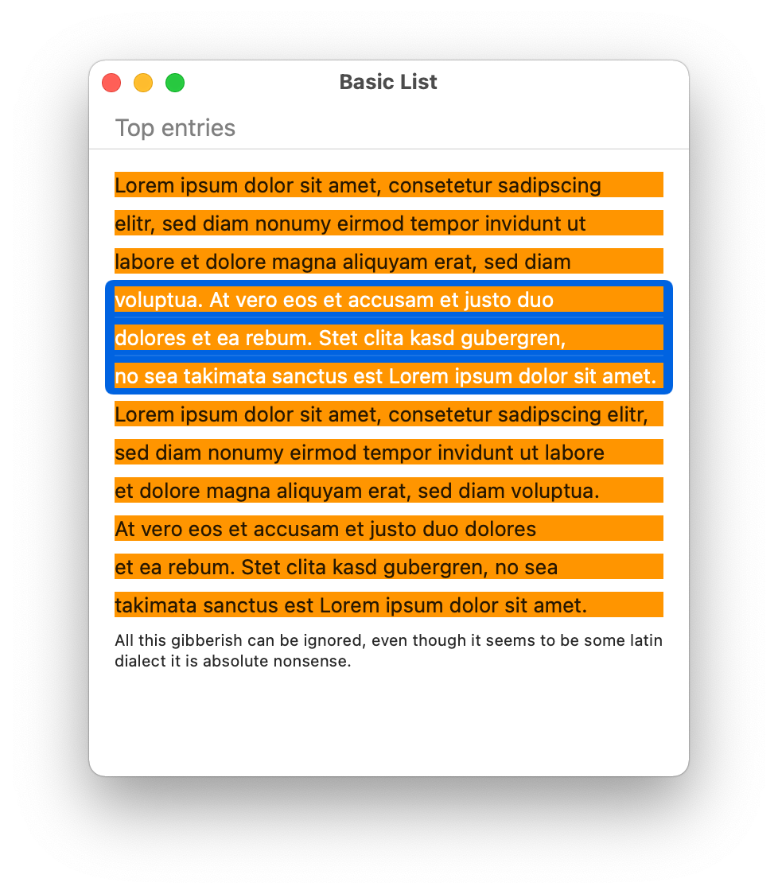

This is where the modifier `.listRowBackground()` comes into play. By using `.listRowBackground(Color.orange)` on your row content, you will see the white space diminish, but you will see that it probably does not work with selection in mind: our row background is overwriting the macOS selection color as shown below:

```swift
Text(element.text)
    .listRowBackground(Color.orange)
````

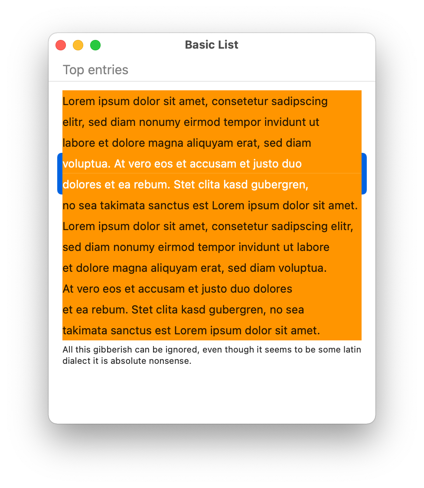

One possible workaround is not drawing the background color when the row is selected!

```swift
Text(element.text)
    .listRowBackground(Group {
        if selection.contains(element.id) == false {
            Color.orange
        }
    })
```

But as you see below, that's not supported. Now only an empty selection is drawn without our row content!

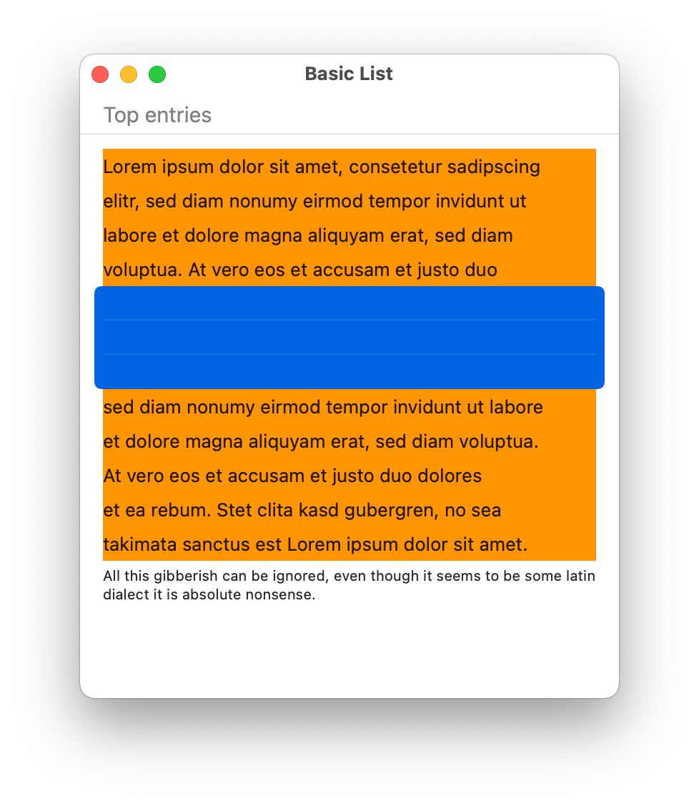

The fix for this problem: Just draw `Color.clear` when the row is selected and `Color.orange` otherwise.

```swift
Text(element.text)
    .listRowBackground(Group {
        if selection.contains(element.id){
            Color.clear
        } else {
            Color.orange
        }
    })
```

Finally: our background color is correctly applied and does not interfere with the selection!

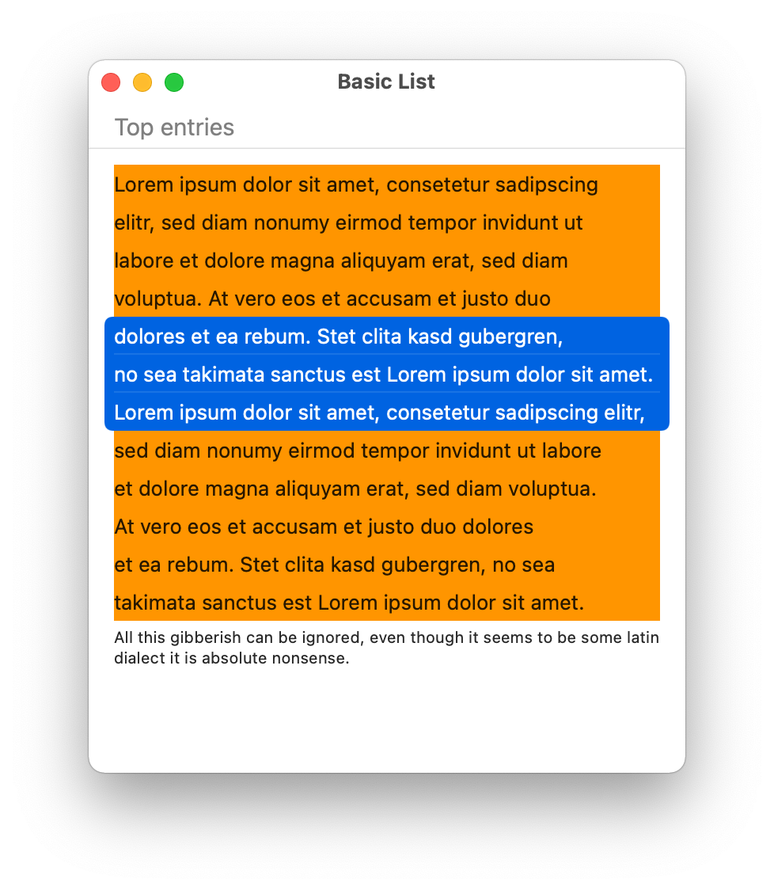

As we have now fixed the list selection, we start to reorder rows again. Now this feature is also broken!

As illustrated below, moving rows will make their height resize randomly!

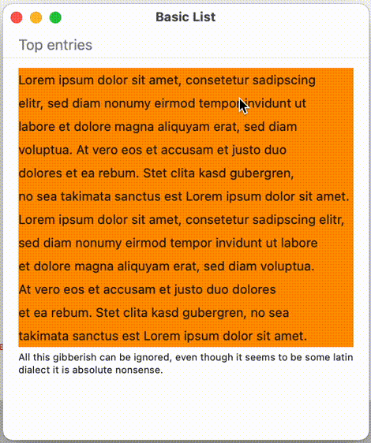

### The nightmare continues

So it seems that while dragging a row around the height of it will change randomly. To fix this, we can add some code to limit the maximum row height: `.frame(maxHeight: 16)`. 16 is in the case of macOS the magic number which fits the default font. But by fixing the height, we break (once again) some great SwiftUI built-in feature: the automatic wrapping of long text in multiple lines. Now we limit artificially all rows to be of single line height and they are going to be truncated when the width of the window shrinks.

So this is not really a good fix. Our goal is: while and after being dragged around, the view should keep its initial size. This means we want to have the view resize "naturally" as it would normally, but inhibit the increase of the size. A possible way to attack this problem: measure the size of the row using `GeometryReader` and keeping this information to limit an increase of the height later.
To use `GeometryReader` properly I suggest to move the row view code into its own `Row` view and observe the size changes for a moment:

```swift
struct Row: View {
    let text: String
    let isSelected: Bool

    //@State private var rowSize: CGSize?

    var body: some View {
        Text(text)
            .listRowBackground(Group {
                    if isSelected {
                        Color.clear
                    } else {
                        Color.orange
                    }
                }
            )
            .background(GeometryReader { proxy in
                let _ = handleSize(proxy.frame(in: .local).size)
                Color.clear
            })
            //.frame(maxHeight: rowSize?.height)
    }

    private func handleSize(_ size: CGSize) {
        print("size", size, text.prefix(5))
        //if rowSize != size {
        //    DispatchQueue.main.async {
        //        rowSize = size
        //    }
        //}
    }
}
```

As you can see, I've commented all code related to maintaining the `rowSize` `@State` property and using it for row height limitation. We will now look at how the row's size after they have been dragged around:

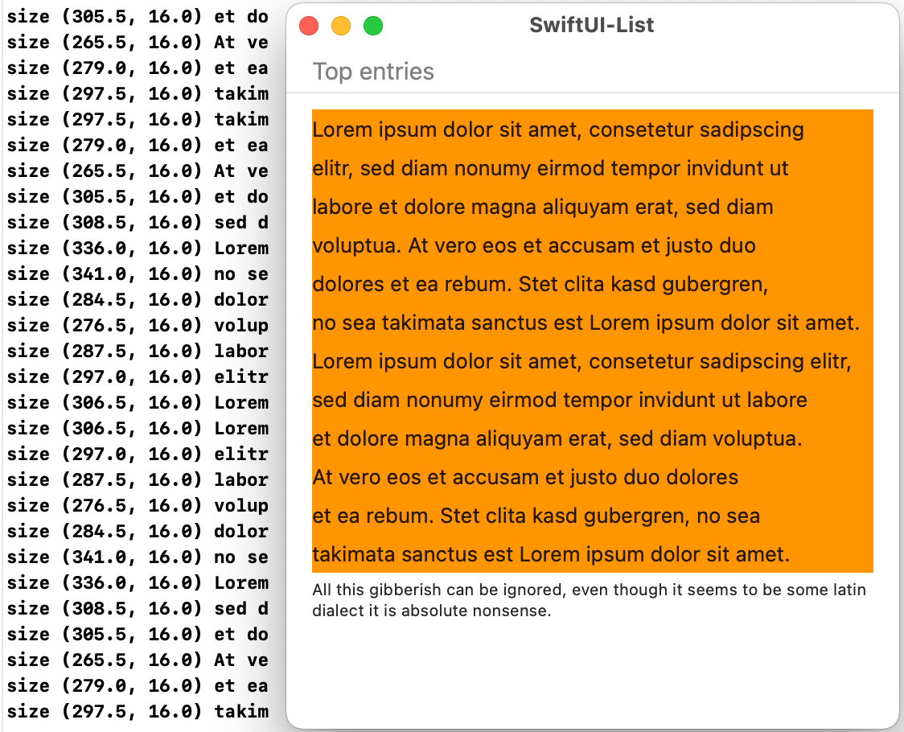  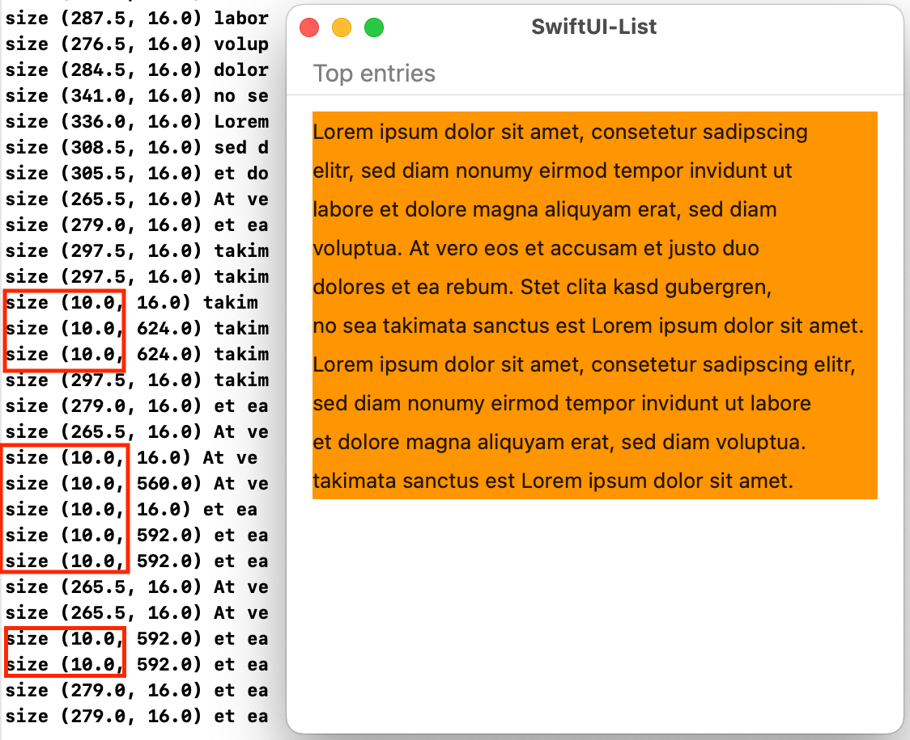

Highlighted in the screenshot above, we see that the rows width suddenly changes to 10 just before the height is increased to an unreasonable large value. It's also visible in the screenshot that not only the row dragged around is suffering the change, but also the others which are moved around. It seems as if all the rows would have a reasonable sizes at the end of the process, but the row background is larger than what is needed to draw it's content!
As a next step we remove the commented code for our `rowSize` state and the height limitation and modify the `handleSize` method to ignore all size changes to a width of 10, as shown below:

```swift
private func handleSize(_ size: CGSize) {
    print("size", size, text.prefix(5))
    if rowSize != size && size.width != 10 {
        DispatchQueue.main.async {
            rowSize = size
        }
    }
}
```

**Juhu**, this fixes the random height changes of the row we have seen before! But as also written earlier: limiting the height to a specific value will inhibit the automatic adjustment of the row if there are space constraints. For example when the window width is reduced, some of the lines of text would start wrapping onto two lines and therefore **want** to increase the height. That is not working anymore!

So we have to add another small fix: we have to force our `Text` view to have use it's ideal size vertically (=height). This can be done by adding the `.fixedSize(horizontal: false, vertical: true)` modifier to our `Text` element.

We now reached our goal for this chapter: A `List` with a **custom background color** and working standard behavior like row **resizing, selection and reordering**!

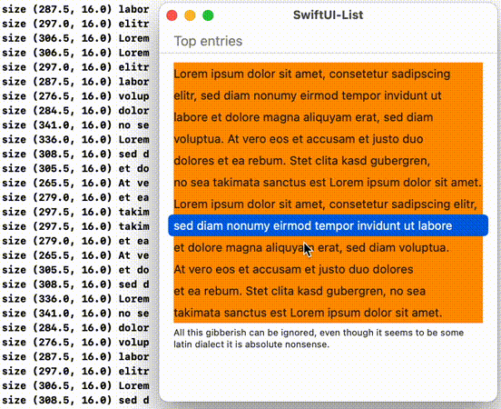

The full source-code for this view can be found in [Shared/CustomizedList.swift](Shared/CustomizedList.swift).
